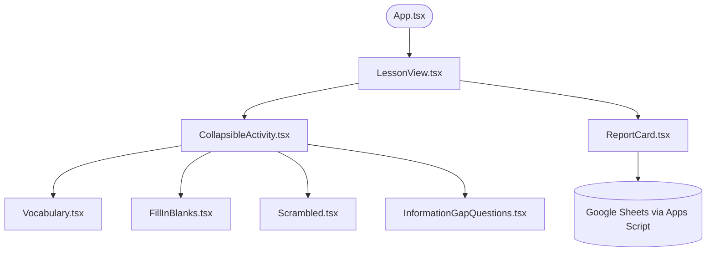

# Design Document: Interactive Language Learning Worksheets

**Author(s):** TJ Components Authors  
**Reviewer(s):** Teacher Jake, Project Reviewers  
**Created:** 2026-06-02  
**Last Updated:** 2026-06-02  
**Status:** Approved / Implemented  

---

## 1. Objective & Executive Summary

### Context
This project provides premium, interactive language learning worksheets designed to be embedded in external platforms (such as Ghost blogs) or run as a standalone web application. The worksheets support various activities including Vocabulary matching, Fill-in-the-blanks, Comprehension quizzes, Scrambled sentences, and Information Gap speaking activities.

### Goal
Document the design system, structural conventions, and core integrations of the codebase, ensuring styling remains robust and isolated. This document details guidelines for:
*   Unifying custom CSS Design Tokens and Tailwind CSS configurations.
*   Implementing dark-mode-first responsive designs.
*   Enforcing high-fidelity bilingual typography and print/export layouts.
*   Orchestrating Text-to-Speech (TTS) failovers and Google Apps Script submissions.

### Non-Goals
*   Managing state synchronization between multiple devices (except for the 2-player Information Gap activity which uses cooperative offline/speaking interaction).
*   Hosting direct audio/video streaming media (all media is referenced externally or managed in PocketBase CMS).

---

## 2. Background & Existing Architecture

The codebase contains a React 19 application built on Vite and Tailwind CSS 4, backed by a PocketBase database for lesson storage. Originally, the system relied on vanilla custom elements and host-scoped CSS variables. 

### Current Components & Guides
*   **[Submission Guide](file:///var/home/jmayer/Dev/language-learning-worksheets/SUBMISSION_GUIDE.md)**: Details the Apps Script configuration for spreadsheet score recording.
*   **[TTS Guide](file:///var/home/jmayer/Dev/language-learning-worksheets/TTS_GUIDE%201.2.md)**: Details the Web Speech API priority fallback and lazy voice loading.
*   **[Printing Guide](file:///var/home/jmayer/Dev/language-learning-worksheets/PRINTING_GUIDE.md)**: Outlines direct printing isolation via `:has()` selectors and Google Docs clipboard export.

---

## 3. High-Level Architecture

The worksheet interface is structured in components:



*   **App.tsx** ([App.tsx](file:///var/home/jmayer/Dev/language-learning-worksheets/App.tsx)): Handles routing, filter states (language, level, category), and views (home, lesson, admin, editor).
*   **LessonView.tsx** ([LessonView.tsx](file:///var/home/jmayer/Dev/language-learning-worksheets/components/Lesson/LessonView.tsx)): Orchestrates the display of reading passages, audio players, vocabulary lists, and activity sections.
*   **ReportCard.tsx** ([ReportCard.tsx](file:///var/home/jmayer/Dev/language-learning-worksheets/components/UI/ReportCard.tsx)): Collects performance metrics, validates student codes, and submits results to the external Sheets pipeline.

---

## 4. Detailed Design & Styling Guidelines

To prevent styling conflicts and ensure a premium visual aesthetic, developers must strictly adhere to the following unified design system.

### A. Design Tokens & Color Palette
The primary brand colors align with a **deep forest green** and **light mint/green** theme. The tokens are declared inside [index.css](file:///var/home/jmayer/Dev/language-learning-worksheets/index.css) and exposed globally.

#### Suggested Improvement: Unifying Tailwind and CSS Variables
To prevent developers from hardcoding Tailwind arbitrary colors (like `bg-blue-600` or `text-green-900`) which breaks design consistency and dark mode support, the Tailwind v4 theme block must map the `--tj-*` CSS variables:

```css
/* index.css */
@import "tailwindcss";

@theme {
  --color-tj-primary: var(--tj-primary-color, #2563eb);
  --color-tj-primary-hover: var(--tj-primary-hover, #1d4ed8);
  --color-tj-primary-light: var(--tj-primary-light, #eff6ff);
  --color-tj-primary-border: var(--tj-primary-border, #bfdbfe);
  
  --color-tj-success: var(--tj-success-color, #22c55e);
  --color-tj-success-light: var(--tj-success-light, #f0fdf4);
  
  --color-tj-error: var(--tj-error-color, #ef4444);
  --color-tj-error-light: var(--tj-error-light, #fef2f2);
  
  --color-tj-text-main: var(--tj-text-main, #1e293b);
  --color-tj-text-muted: var(--tj-text-muted, #64748b);
  --color-tj-bg-main: var(--tj-bg-main, #f8fafc);
  --color-tj-bg-card: var(--tj-bg-card, rgba(255, 255, 255, 0.95));
  --color-tj-border-main: var(--tj-border-main, #e2e8f0);

  /* Deep Forest Green UI Header Palette */
  --color-tj-forest: var(--tj-brand-forest, #064e3b);
  --color-tj-mint: var(--tj-brand-mint, #ecfdf5);
  --color-tj-mint-dark: var(--tj-brand-mint-dark, #0f766e);
}
```

*Implementation Instruction:* In components like [Button.tsx](file:///var/home/jmayer/Dev/language-learning-worksheets/components/UI/Button.tsx) or [Vocabulary.tsx](file:///var/home/jmayer/Dev/language-learning-worksheets/components/Activities/Vocabulary.tsx), replace hardcoded values (e.g. `bg-green-600`) with custom variables mapped via Tailwind (e.g. `bg-tj-success` or `text-tj-forest`).

### B. Natively Supported Dark Mode
To support dynamic system toggling without duplicating utility selectors:
*   Define light-theme values on the `:root` element.
*   Re-map the variables within a `prefers-color-scheme: dark` media block inside [index.css](file:///var/home/jmayer/Dev/language-learning-worksheets/index.css):

```css
:root {
  --tj-primary-color: #2563eb;
  --tj-success-color: #22c55e;
  --tj-error-color: #ef4444;
  --tj-text-main: #1e293b;
  --tj-text-muted: #64748b;
  --tj-bg-main: #f8fafc;
  --tj-bg-card: rgba(255, 255, 255, 0.95);
  --tj-border-main: #e2e8f0;
}

@media (prefers-color-scheme: dark) {
  :root {
    --tj-text-main: #f8fafc;
    --tj-text-muted: #94a3b8;
    --tj-bg-main: #0f172a;
    --tj-bg-card: rgba(30, 41, 59, 0.95);
    --tj-border-main: #334155;
  }
}
```

### C. Bilingual Typography Strategy
The application supports bilingual layout styling (e.g. English-Thai). 
*   **UI Labels / Latin Texts**: Use modern, highly-readable sans-serif fonts such as `Outfit` or `Inter`.
*   **Thai Passages & Literature**: To match the current styling in `index.css`, use `Noto Serif Thai`.
*   **Tailwind Font Class Definition**:
    ```css
    @theme {
      --font-sans: "Outfit", "Inter", system-ui, sans-serif;
      --font-thai: "Noto Serif Thai", serif;
    }
    ```
    *Rule:* Wrap non-English text blocks or passage details in `font-thai` to render serif scripts properly, and use `font-sans` for main UI components. Apply the attribute `translate="no"` on labels where Web Speech API speaks words in a specific target language to avoid browser auto-translate pollution.

### D. Mobile-First "Edge-to-Edge" Layouts
To prioritize layout efficiency on mobile viewports (< 640px):
1.  **Card Stripping**: Remove drop shadows, card borders, and backgrounds (`shadow-none border-none bg-transparent`).
2.  **Padding Adjustment**: Tighten inner paddings from `p-8` / `p-6` on desktop down to `p-4` or `p-2` on mobile.
3.  **Corner Flattening**: Set border radius to `rounded-none` on cards to allow content to span edge-to-edge.
4.  **Header Anchors**: Maintain sticky bars or progress bars to structure page progression.

---

## 5. Offline & Print System Design

Interactive worksheets must print cleanly and support exports to word processors.

### A. Universal Isolation Print Logic
When printing is triggered, the page styles must strip away external blog containers (Ghost, Astro, headers, footers).
*   **Isolation via `:has()`**: Target roots containing `.tj-printable-worksheet` and hide non-essential DOM hierarchies.
*   **Replacing Interactive Elements**:
    *   Hide all media playback actions, voice selectors, and check-answer buttons.
    *   Replace inputs (`<input>`, `<textarea>`) with static dotted writing lines (e.g. `..........................................`) or empty checkbox brackets (`[  ]`) to make worksheets writable on paper.
    *   Expand collapsed dropdowns and lists to display options or matching items fully.

### B. Google Docs Clipboard Export
The "Copy for Google Docs" button in [WorksheetExportActions.tsx](file:///var/home/jmayer/Dev/language-learning-worksheets/components/UI/WorksheetExportActions.tsx) uses the `ClipboardItem` API to write raw formatted HTML directly into the user's system clipboard.
*   **Compatibility**: To ensure Microsoft Word and Google Docs correctly parse colors, table borders, and paragraphs when pasting:
    *   Inline all style properties on target elements (do not rely on external CSS classes).
    *   Avoid complex grid elements; fall back to table layouts (`<table>`, `<tr>`, `<td>`) to preserve vocabulary columns and scrambled matching layouts.

---

## 6. Text-to-Speech (TTS) Failover Architecture

TTS relies on browser-level Web Speech APIs, which suffer from browser-specific quirks and in-app webview restrictions.

### A. Voice Hierarchy Fallback
To provide high-fidelity output (avoiding standard robotic voices), filter using the following search priorities:
1.  **Natural Voices**: Look for `"natural"` in the voice name (e.g., Microsoft Edge Natural voices).
2.  **Google Voices**: Fall back to `"google"` voices.
3.  **Premium/Siri**: Look for `"premium"` or `"siri"`.
4.  **Platform Standard**: Select the first native voice matching the target language prefix (e.g., `"en"`).

*Android Requirement:* On Android devices, developers **must** explicitly define `SpeechSynthesisUtterance.lang` in addition to assigning the `utterance.voice` parameter. Failing to do so causes the system to override the voice selection back to default language accents.

### B. Lazy Voice Synchronization
Browsers load voices asynchronously.
*   Bind the voice list updating function to `window.speechSynthesis.onvoiceschanged`.
*   Establish defensive timeouts (`500ms` and `1500ms`) to force-refresh the voice list if the lazy-loading event fails to trigger on mobile browsers.

### C. In-App WebView Redirects
In-app webviews (Instagram, Facebook, Messenger, Line) block or break `speechSynthesis` operations.
1.  **Detection**: Evaluate the browser User Agent for substrings like `instagram`, `fb_iab`, `line`, or generic Android `wv` webviews.
2.  **Redirect**: On Android, construct a Chrome Intent URL to launch Chrome:
    ```javascript
    const urlNoScheme = window.location.href.replace(/^https?:\/\//, '');
    const intentUrl = `intent://${urlNoScheme}#Intent;scheme=${window.location.protocol.replace(':', '')};package=com.android.chrome;end`;
    ```
3.  **Overlay Prompt**: Present a full-page modal containing instructions requesting iOS users to "Open in Safari" and Android users to click "Open in Chrome" (redirecting via the Intent link).

---

## 7. Submissions & "Proof of Work" Verification

Worksheet scores are tracked by submitting standard JSON payloads to a Google Apps Script web application.

### A. Data Transmission Contract
The submission payload sent to the `doPost` endpoint contains:
```json
{
  "nickname": "Student Nickname",
  "homeroom": "Homeroom Grade",
  "studentId": "ID-1234",
  "quizName": "Chapter 1: Volcanoes",
  "score": 8,
  "total": 10
}
```

### B. "Proof of Work" Flow
To protect sheet submissions, the dashboard locks spreadsheet integration behind a **Teacher Code** (`6767`).
1.  **Independent Progress**: Students can complete and view report cards without entering a teacher code.
2.  **Submission Lock**: The "Submit to Teacher" action requires the code to be verified.
3.  **Screenshot Fallback**: If a student is offline or lacks the submission code, the UI prompts them to take a screenshot of the interactive report card. The report card displays a dynamic timestamp and score layout to serve as valid "Proof of Work."

---

## 8. Alternatives Considered

### Tailwind Utility Classes vs CSS Custom Variables
*   *Tailwind-Only*: Keeps development fast but makes embedding in third-party platforms (like Ghost blogs) highly vulnerable to style leakages from parent stylesheets.
*   *CSS Variables*: Highly isolated, but slower to author.
*   *Selected Approach*: Map Tailwind v4 theme options directly to CSS custom properties. This retains Tailwind's rapid developer experience while keeping the style theme variables skin-overrideable from a single parent `:host` declaration.

---

## 9. Verification & Testing Plan

### Automated Checks
*   Build confirmation: Execute `npm run build` inside a Silverblue toolbox environment.

### Manual Verification Flow
1.  **Mobile Viewport Verification**: Toggle responsive design in Chrome DevTools; verify edge-to-edge style classes trigger correctly below 640px.
2.  **Web Speech API Fallback**: Check the console log outputs to ensure voice arrays are initialized and that high-quality default options are automatically selected on page load.
3.  **Direct Printing Check**: Press `Ctrl+P` (or print layout trigger); verify in the print preview window that the navbar is hidden and interactive inputs render as printable underscores.
4.  **Google Docs Clipboard Validation**: Click "Copy for Google Docs", paste the contents into a new document, and verify formatting, tables, and borders preserve their layout.
